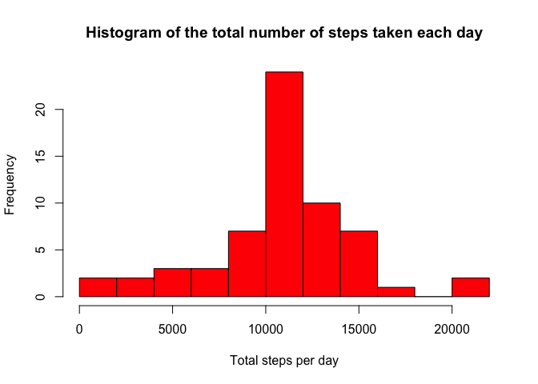

In this assignment, I will use dplyr and lattice packages

```r
library(dplyr)
library(lattice)
```

## Loading and preprocessing the data

```r
activity = read.csv('activity.csv')

activity$date = as.Date(as.character(activity$date), '%Y-%m-%d') #Convert to date
```

```
## Warning in strptime(x, format, tz = "GMT"): unknown timezone 'default/
## Europe/Helsinki'
```

```r
summary(activity) #Quick summary of the dataset
```

```
##      steps             date               interval     
##  Min.   :  0.00   Min.   :2012-10-01   Min.   :   0.0  
##  1st Qu.:  0.00   1st Qu.:2012-10-16   1st Qu.: 588.8  
##  Median :  0.00   Median :2012-10-31   Median :1177.5  
##  Mean   : 37.38   Mean   :2012-10-31   Mean   :1177.5  
##  3rd Qu.: 12.00   3rd Qu.:2012-11-15   3rd Qu.:1766.2  
##  Max.   :806.00   Max.   :2012-11-30   Max.   :2355.0  
##  NA's   :2304
```

## What is mean total number of steps taken per day?


```r
# Pivot the dataset
activity_day = activity %>% group_by(date) %>% summarise(total_steps = sum(steps))

# Histogram of the total number of steps taken each day
hist(activity_day$total_steps, breaks = 10, main = 'Histogram of the total number of steps taken each day', xlab = 'Total steps per day', col = 'blue')
```

<!-- -->
The mean total number of steps taken per day:

```r
mean(activity_day$total_steps, na.rm = TRUE)
```

```
## [1] 10766.19
```
And the median is:

```r
median(activity_day$total_steps, na.rm = TRUE)
```

```
## [1] 10765
```

## What is the average daily activity pattern?


```r
activity_interval = activity %>% group_by(interval) %>% summarise(average.steps = mean(steps, na.rm = TRUE))

# Plot the time series
plot(activity_interval$interval, activity_interval$average.steps, type = 'l', xlab = "5-min interval", ylab = "Average across all Days", main = "Average number of steps taken", col = "blue")
```

<!-- -->

Which 5-minute interval, on average across all the days in the dataset, contains the maximum number of steps?

```r
activity_interval$interval[which.max(activity_interval$average.steps)]
```

```
## [1] 835
```

## Imputing missing values

The total number of missing values in the dataset:

```r
sum(is.na(activity))
```

```
## [1] 2304
```

The method for filling in all of the missing values in the dataset is using the mean for the 5-minute interval

```r
fillNA = numeric()
for (i in 1:nrow(activity)) {
    obs = activity[i, ]
    if (is.na(obs$steps)) {
        steps = subset(activity_interval, interval == obs$interval)$average.steps
    } else {
        steps = obs$steps
    }
    fillNA = c(fillNA, steps)
}

new_activity = activity
new_activity$steps = fillNA

# Check if the new data has no NA value
summary(new_activity)
```

```
##      steps             date               interval     
##  Min.   :  0.00   Min.   :2012-10-01   Min.   :   0.0  
##  1st Qu.:  0.00   1st Qu.:2012-10-16   1st Qu.: 588.8  
##  Median :  0.00   Median :2012-10-31   Median :1177.5  
##  Mean   : 37.38   Mean   :2012-10-31   Mean   :1177.5  
##  3rd Qu.: 27.00   3rd Qu.:2012-11-15   3rd Qu.:1766.2  
##  Max.   :806.00   Max.   :2012-11-30   Max.   :2355.0
```
Histogram of the total number of steps taken each day

```r
activity_day2 = new_activity %>% group_by(date) %>% summarise(total_steps = sum(steps))

# Histogram of the total number of steps taken each day
hist(activity_day2$total_steps, breaks = 10, main = 'Histogram of the total number of steps taken each day', xlab = 'Total steps per day', col = 'red')
```

<!-- -->

Now the mean total number of steps taken per day:

```r
mean(activity_day2$total_steps, na.rm = TRUE)
```

```
## [1] 10766.19
```
And the median is:

```r
median(activity_day2$total_steps, na.rm = TRUE)
```

```
## [1] 10766.19
```

We can see that after replacing the mean stays the same but the median is now a little bit different

## Are there differences in activity patterns between weekdays and weekends?

First let's create a new variable for the day of week and mutate it to Weekday and Weekend


```r
new_activity$dayofweek = weekdays(new_activity$date)

new_activity = new_activity %>% mutate(dayofweek = ifelse(dayofweek %in% c('Saturday','Sunday'), 'Weekend', 'Weekday'))

new_activity$dayofweek = as.factor(new_activity$dayofweek)
```

Time series plot of the 5-minute interval (x-axis) and the average number of steps taken, averaged across all weekday days or weekend days (y-axis).


```r
# First pivot the data by interval and dayofweek
activity_interval2 = new_activity %>% group_by(interval, dayofweek) %>% summarise(average.steps = mean(steps, na.rm = TRUE))

# Plot the time series
xyplot(average.steps ~ interval|dayofweek, activity_interval2, type = "l", layout = c(1, 2), main = 'Average number of steps taken', xlab = "5-min interval", ylab = "Average number of steps")
```

<!-- -->

